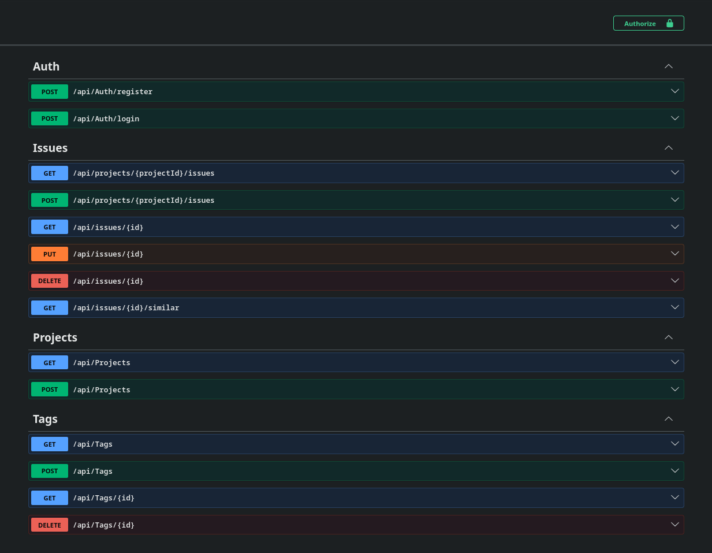

# Debugged — Bug Knowledge Base API

<p align="center">
  
  
  
  
  
  
  
  
  
  
  
  
</p>

A personal bug knowledge base built as an ASP.NET Core Web API.
Instead of deleting resolved bugs, they are archived with their solution
and made searchable. When a developer logs a new issue, the API checks
for similar resolved issues and surfaces them — turning past mistakes
into a learning resource.

---

## Table of Contents

- [Core Concept](#core-concept)
- [Tech Stack](#tech-stack)
- [Project Structure](#project-structure)
- [Running Locally](#running-locally)
  - [Prerequisites](#prerequisites)
  - [1. Clone](#1-clone)
  - [2. Start PostgreSQL in Docker](#2-start-postgresql-in-docker)
  - [3. Apply migrations](#3-apply-migrations)
  - [4. Run](#4-run)
- [Trying It Out](#trying-it-out)
- [Screenshots](#screenshots)
- [Endpoints](#endpoints)
- [Architecture Notes](#architecture-notes)
- [Configuration](#configuration)
- [CI](#ci)
- [License](#license)


---

## Core Concept

The standout feature is **Similar Issues matching**. When you log a new
issue with tags and an error message, the API searches your archived
issues and returns the closest matches — so you instantly see "you've
solved this kind of problem before, here's how."

Matching is computed entirely in SQL (`ILIKE` for case-insensitive error
message search, count of shared tags via the join table). Results are
ranked by total match score and capped at 10.

---

## Tech Stack

- **.NET 10** — ASP.NET Core Web API
- **Clean Architecture** — 4 layers (API, Application, Domain, Infrastructure)
- **CQRS** with **MediatR** — separated read/write paths
- **Entity Framework Core** with **PostgreSQL** (Npgsql provider)
- **ASP.NET Identity** + **JWT Bearer** — authentication with role-based access control
- **AutoMapper** — entity → DTO mapping
- **FluentValidation** — request validation via MediatR pipeline behavior
- **Swagger / OpenAPI** — interactive API docs

---

## Project Structure

```
src/
├── Debugged.API/             # Controllers, Program.cs, middleware, services
├── Debugged.Application/     # Commands, Queries, Handlers, DTOs, Validators, Interfaces
├── Debugged.Domain/          # Entities, Enums (zero framework dependencies)
└── Debugged.Infrastructure/  # DbContext, Repositories, Migrations, Identity, JWT
```

Dependencies point inward toward `Domain`. `Domain` depends on nothing.

---

## Running Locally

### Prerequisites

- **.NET 10 SDK** (`dotnet --version` should show `10.0.x`)
- **Docker** (for PostgreSQL)
- **dotnet-ef** CLI tool:
  ```bash
  dotnet tool install --global dotnet-ef
  ```

### 1. Clone

```bash
git clone https://github.com/Megjafari/debugged-api.git
cd debugged-api
```

### 2. Start PostgreSQL in Docker

```bash
docker run -d \
  --name debugged-postgres \
  -e POSTGRES_USER=debugged \
  -e POSTGRES_PASSWORD=debugged_dev \
  -e POSTGRES_DB=debugged \
  -p 5432:5432 \
  postgres:17
```

If the container already exists from a previous run, just start it:
```bash
docker start debugged-postgres
```

### 3. Apply migrations

```bash
dotnet ef database update --project src/Debugged.Infrastructure --startup-project src/Debugged.API
```

This creates all tables: domain (`Projects`, `Issues`, `Tags`, `IssueTags`) and Identity (`AspNetUsers`, `AspNetRoles`, etc.).

### 4. Run

```bash
dotnet run --project src/Debugged.API
```

On first startup, the seeder automatically creates:
- Two roles (`User`, `Admin`)
- An **admin user**: `admin@debugged.local` / `Admin1234`
- A **demo user**: `demo@debugged.local` / `Demo1234`
- One demo project with three sample issues (one resolved, two open) and six tags

Open Swagger at **http://localhost:5068/swagger**.


## Screenshots



---

## Trying It Out

The fastest way to see the core feature working:

### 1. Log in

`POST /api/auth/login`
```json
{ "email": "demo@debugged.local", "password": "Demo1234" }
```

Copy the `token` from the response.

### 2. Authorize in Swagger

Click the **Authorize** button (top right), paste `Bearer <token>`, click Authorize → Close.

> **Note**: If the Swagger UI doesn't appear to send the token reliably (a known Swashbuckle + OpenAPI 2.x quirk), use `curl` with `-H "Authorization: Bearer <token>"` — same behavior, more reliable.

### 3. List projects and issues

```
GET /api/projects
GET /api/projects/{projectId}/issues
```

### 4. Find similar issues — the star feature

Take the id of the **open** issue "Realtime updates dropping in production" and call:

```
GET /api/issues/{openIssueId}/similar
```

You should see the resolved websocket issue come back with `matchScore: 3` and its `solution` field populated — i.e. the API just told you "this is how a similar bug was fixed last time."

---

## Endpoints

| Method | Endpoint | Auth |
|---|---|---|
| POST | `/api/auth/register` | Anonymous |
| POST | `/api/auth/login` | Anonymous |
| GET | `/api/projects` | Authenticated |
| POST | `/api/projects` | Admin |
| GET | `/api/projects/{projectId}/issues` | Authenticated |
| POST | `/api/projects/{projectId}/issues` | Authenticated |
| GET | `/api/issues/{id}` | Authenticated |
| PUT | `/api/issues/{id}` | Authenticated |
| DELETE | `/api/issues/{id}` | Authenticated (soft delete → status `Archived`) |
| GET | `/api/issues/{id}/similar` | Authenticated |
| GET | `/api/tags`, `/api/tags/{id}` | Authenticated |
| POST + DELETE | `/api/tags`, `/api/tags/{id}` | Admin |

---

## Architecture Notes

- **Domain stays framework-free**: `Issue.CreatedByUserId` is a raw `Guid`, not a nav property. `ApplicationUser : IdentityUser<Guid>` lives in Infrastructure
- **Anemic entities for now**; `Resolve()`/`Reopen()` domain methods would be a natural next refactor
- **Soft delete for issues**: archived bugs (and their solutions) remain searchable — the whole point of the knowledge base
- **Hard delete for tags**: tags carry no knowledge themselves, so deletion cascades to `IssueTag` rows
- **Tag normalization in handlers**: trim + lowercase + distinct before DB lookup
- **SQL-computed match score**: `FindSimilarResolvedAsync` projects `(TagMatches + ErrorMatches)` inside the EF query — no in-memory scoring
- **Generic login errors**: same `"Invalid email or password."` for unknown email and wrong password — prevents account enumeration
- **`ClockSkew = TimeSpan.Zero`**: tokens expire exactly when claimed
- **MediatR `ValidationBehavior`** runs FluentValidation validators in parallel before handlers; failures bubble up as `ValidationException` → 400 ProblemDetails via the exception-handling middleware

---

## Configuration

`src/Debugged.API/appsettings.json` ships with development defaults:

- **Connection string** points to the local Docker PostgreSQL above
- **JWT secret** is a development-only key, committed for examiner convenience. In a real deployment it would come from User Secrets, environment variables, or a key vault — never source control

---

## CI

GitHub Actions runs on every PR to `main`:
- Restore → Build (Release) → Test
- Branch protection on `main`: PR required, force-push blocked, status check `Build & Test` must pass

---

## License

School assignment — not licensed for redistribution.